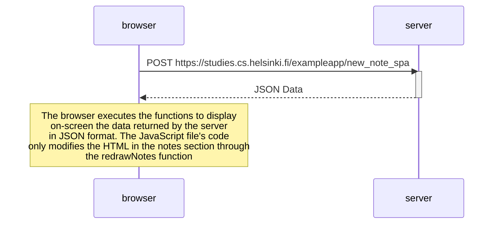

```mermaid
sequenceDiagram
    participant browser
    participant server

    browser->>server: POST https://studies.cs.helsinki.fi/exampleapp/new_note_spa
    activate server
    server-->>browser: JSON Data
    deactivate server

    Note over browser: The browser executes the functions to display<br> on-screen the data returned by the server <br>in JSON format. The JavaScript file's code <br>only modifies the HTML in the notes section through<br> the redrawNotes function

```